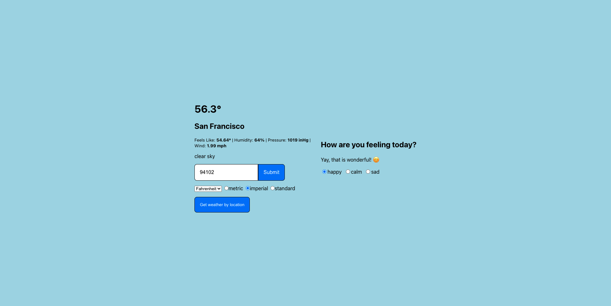

# WeatherVibes

Web app to get the current weather information in your given location whether by entering in your zip code or clicking the “Get weather by location” button.

## Instructions
1. Goto the GitHub Pages I have [here](https://matthewwei35.github.io/weathervibes/) to use weathervibes.
2. Choose what measuring system you want from metric (Celcius), imperial (Fahrenheit), and standard (Kelvin).
3. You have two options to get you weather information after you chose your prefered measuring system. (1) Enter your zip code into the form that says "Enter zip code" and press submit. The weather information should show up after a few seconds. (2) Click the "Get weather by location" button below. Your browser should ask for permission to know your location, allow it as this is needed to use geolocation. The weather information should show up after a few seconds.
4. Now once you know the weather, you are able to select how you're feeling under the "How are you feeling today?" on the right. A message should pop up depending what you selected. 

## Technologies
1. React
2. SASS
